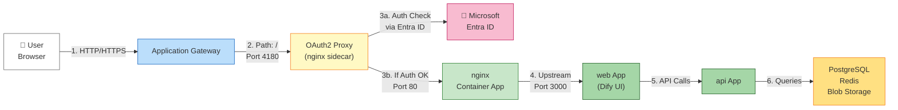
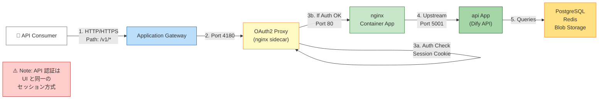
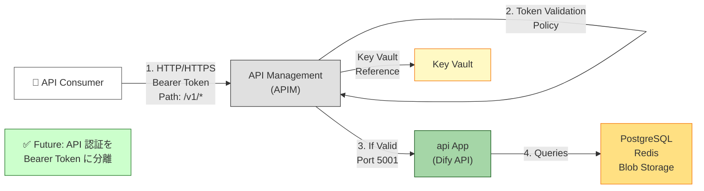
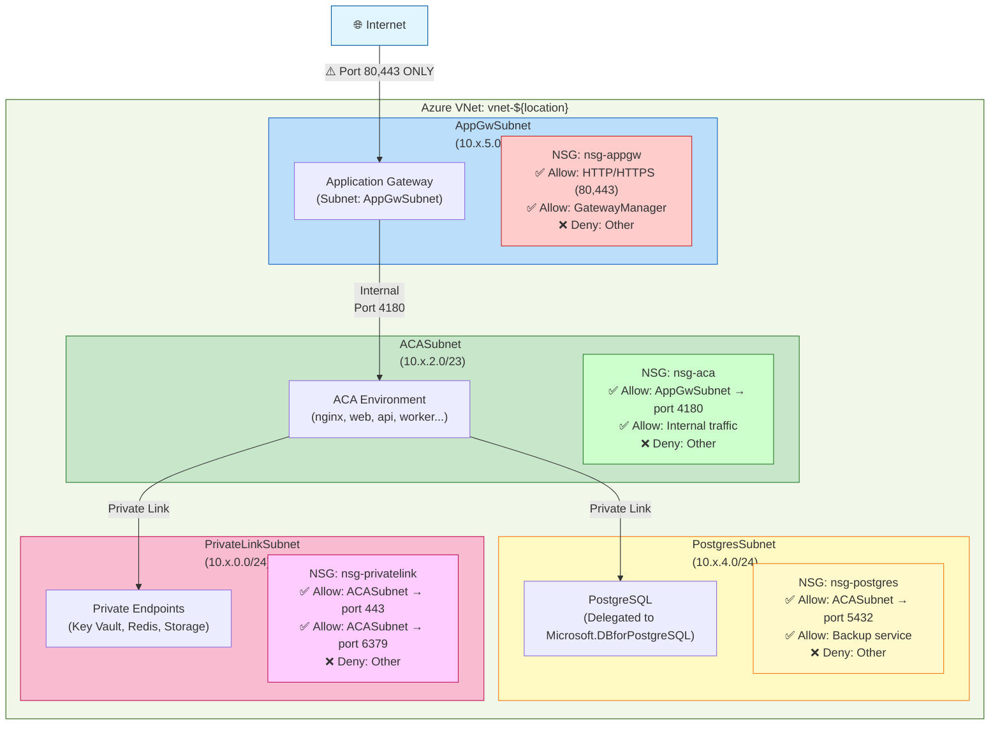
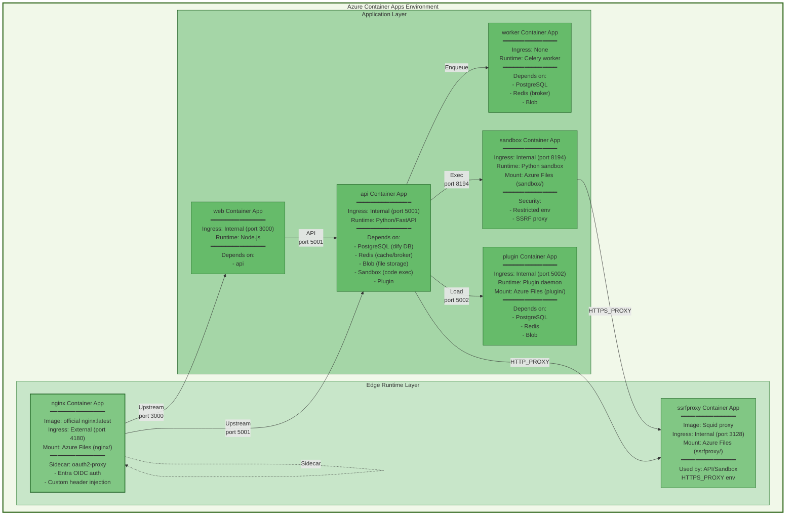
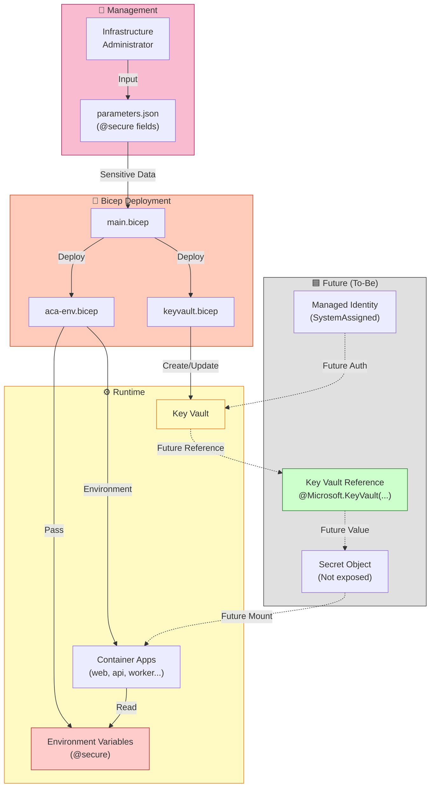
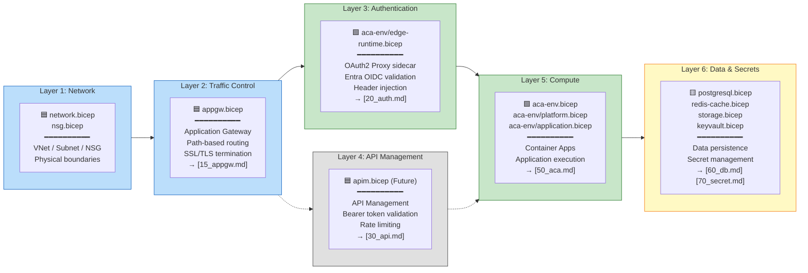

# アーキテクチャ

Dify on Azure のシステムアーキテクチャと各コンポーネントの相互関係を図式化する。

## 1. 全体アーキテクチャ

```mermaid
graph TB
    subgraph Internet["🌐 Internet"]
        Client["クライアント<br/>(Browser/API Consumer)"]
    end

    subgraph Azure["☁️ Azure"]
        subgraph PublicLayer["🟦 Public Layer"]
            PIP["Public IP<br/>(dify-appgw-pip)"]
            AppGw["Application Gateway<br/>(appgw.bicep)"]
        end

        subgraph NetworkLayer["🟦 Network Layer"]
            VNet["VNet: vnet-${location}"]
            AppGwSubnet["AppGwSubnet<br/>(10.x.5.0/24)"]
            ACASubnet["ACASubnet<br/>(10.x.2.0/23)"]
            PostgresSubnet["PostgresSubnet<br/>(10.x.4.0/24)"]
            PrivateLinkSubnet["PrivateLinkSubnet<br/>(10.x.0.0/24)"]
            NSG["NSG (Network Security Groups)"]
        end

        subgraph ComputeLayer["🟩 Compute Layer (ACA Environment)"]
            ACAEnv["Azure Container Apps<br/>Environment (internal)"]
            
            subgraph EdgeRuntime["Edge Runtime"]
                Nginx["nginx<br/>(External Ingress)<br/>- Public Entry Point<br/>- OAuth2 Proxy Sidecar"]
                SSRF["ssrfproxy<br/>(Squid)"]
            end

            subgraph ApplicationRuntime["Application Runtime"]
                Web["web<br/>(Port 3000)"]
                API["api<br/>(Port 5001)"]
                Worker["worker<br/>(Async Tasks)"]
                Sandbox["sandbox<br/>(Port 8194)"]
                Plugin["plugin<br/>(Port 5002)"]
            end
        end

        subgraph DataLayer["🟨 Data Layer (VNet Private)"]
            subgraph PrivateEndpoints["Private Endpoints<br/>(PrivateLinkSubnet)"]
                PE_KV["pe-keyvault"]
                PE_Redis["pe-redis"]
                PE_Blob["pe-blob"]
                PE_File["pe-file"]
            end

            subgraph DataServices["Data Services"]
                KV["Key Vault<br/>(keyvault.bicep)"]
                Redis["Azure Cache<br/>for Redis<br/>(redis-cache.bicep)"]
                Blob["Storage Account<br/>Blob Storage<br/>(storage.bicep)"]
                FileShare["Azure Files<br/>(nginx, sandbox, etc.)"]
            end

            PostgreSQL["PostgreSQL<br/>Flexible Server<br/>(postgresql.bicep)<br/>- dify DB<br/>- vector DB (pgvector)"]
        end

        subgraph FutureLayer["🟦 Future Layer (To-Be)"]
            APIM["API Management<br/>(apim.bicep)<br/>[Future]"]
            AOAI["Azure OpenAI<br/>Service<br/>[Future]"]
        end
    end

    Client -->|HTTP/HTTPS| PIP
    PIP -->|Port 80/443| AppGw
    AppGw -->|Port 4180<br/>Path-Based Routing| Nginx
    
    AppGw -->|"/v1/* , /api/*"<br/>Future Route| APIM
    
    VNet -.-> AppGwSubnet
    VNet -.-> ACASubnet
    VNet -.-> PostgresSubnet
    VNet -.-> PrivateLinkSubnet

    AppGwSubnet -.-> AppGw
    ACASubnet -.-> ACAEnv

    Nginx -->|Port 4180<br/>OAuth2 Auth| Nginx
    Nginx -->|Port 80<br/>HTTP| Web
    Nginx -->|Port 80<br/>HTTP| API

    API -->|Port 5001| API
    Web -->|Port 3000| Web
    API -->|Internal| Worker
    API -->|HTTP Proxy| SSRF

    Sandbox -->|Mount| FileShare
    Plugin -->|Mount| FileShare
    Nginx -->|Mount| FileShare

    ACAEnv -->|Private<br/>Connection| PE_Redis
    ACAEnv -->|Private<br/>Connection| PE_KV
    ACAEnv -->|Private<br/>Connection| PE_Blob
    ACAEnv -->|Private<br/>Connection| PE_File

    PE_KV -.->|DNS| KV
    PE_Redis -.->|DNS| Redis
    PE_Blob -.->|DNS| Blob
    PE_File -.->|DNS| FileShare

    ACAEnv -->|FQDN<br/>postgres.database...| PostgreSQL

    KV -.->|Stores| Secrets["Secrets:<br/>- DB Password<br/>- Redis Key<br/>- OAuth2 Secret"]

    style Client fill:#fff,stroke:#666
    style Internet fill:#e1f5ff,stroke:#01579b
    style Azure fill:#f1f8e9,stroke:#33691e
    style PublicLayer fill:#bbdefb,stroke:#1565c0
    style NetworkLayer fill:#bbdefb,stroke:#1565c0
    style ComputeLayer fill:#c8e6c9,stroke:#2e7d32
    style DataLayer fill:#fff9c4,stroke:#f57f17
    style FutureLayer fill:#e0e0e0,stroke:#424242
    style EdgeRuntime fill:#a5d6a7,stroke:#1b5e20
    style ApplicationRuntime fill:#81c784,stroke:#1b5e20
    style Secrets fill:#ffe082,stroke:#f57f17
```

## 2. トラフィックフロー図

### UI アクセス経路

### API アクセス経路（現状）

### API アクセス経路（将来予定）

## 3. ネットワークセキュリティ図

## 4. コンテナアプリケーション層構成

## 5. シークレット・認証フロー

## 6. 責務分離マトリクス

## 参考
- [spec.md](./spec/spec.md) - 全体構成と modules 対応表
- [10_network.md](./spec/10_network.md) - ネットワーク基盤
- [15_appgw.md](./spec/15_appgw.md) - Application Gateway
- [20_auth.md](./spec/20_auth.md) - 認証層
- [30_api.md](./spec/30_api.md) - API 管理層
- [50_aca.md](./spec/50_aca.md) - コンテナアプリケーション
- [60_db.md](./spec/60_db.md) - データ層
- [70_secret.md](./spec/70_secret.md) - シークレット管理
